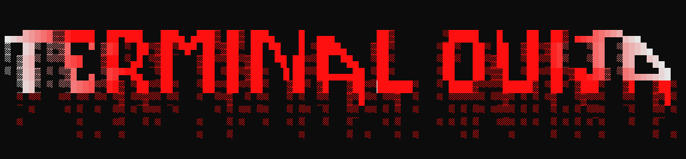

# Terminal-Ouija

## About

Terminal Ouija is a terminal-based "choose your own adventure" with a dark twist.
You (the player) find yourself at an odd antiquities shop, where the proprietor offers to show you his most-treasured relic.  
Before you know it, you are trapped in a terrifying séance, surrounded by some of the most deadly horror movie villains of all time.

Ages 10+

### Technology

This game was made entirely with the magic of [Node.js](https://nodejs.org/en/)

## Play the Game

### Online

The easiest way to experience the thrill and terror of Terminal Ouija is to check out the online REPL.

1. Make your browser fullscreen
2. [Start the REPL](https://repl.it/@elCocodrilo/Terminal-Ouija#index.js)
    - The screen will be divided into three parts:
    
3. Drag both dividers all the way to the left to make the console fullscreen:
    - (The console needs to be full screen to properly view the animations)
    
4. Press the green `Run` button
5. Have fun

**Note: the opening animation isn't quite as smooth on the online REPL.  But hey, at least it's online.*

### Locally

You can also experience the spooky thrill offline on your own device with just a few more steps.

1. Ensure you have [Node.js](https://nodejs.org/en/) (version 12 or later) installed
2. Clone this repository or download the zip file and extract the files
3. Open up a terminal window and make it fullscreen
    - for the proper aesthetic effect, make sure your terminal has a **solid black** background, with **white** letters
    - for Windows users, I highly recommend downloading and using [Windows Terminal](https://www.microsoft.com/en-us/p/windows-terminal/9n0dx20hk701)
4. Navigate to your new `Terminal-Ouija` directory in the terminal
5. Start the game with the command `npm start`
6. Have fun
